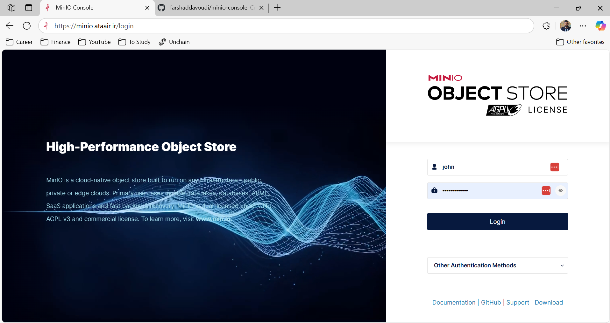
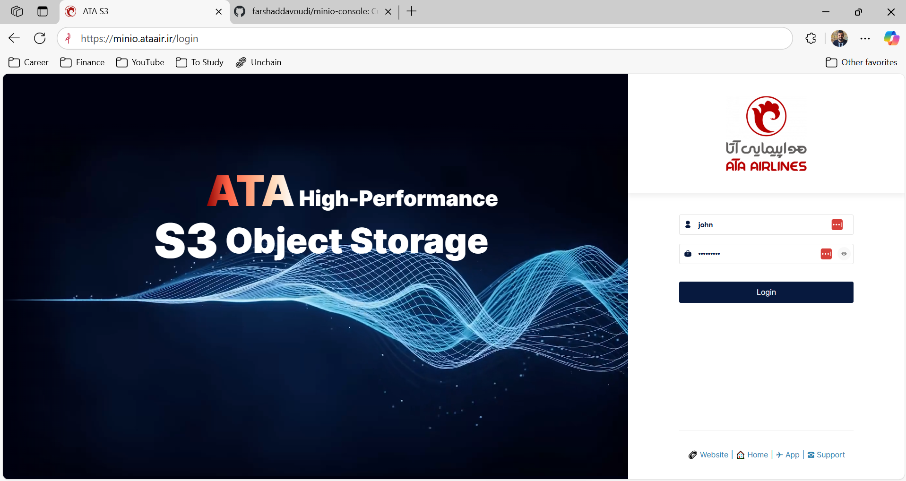
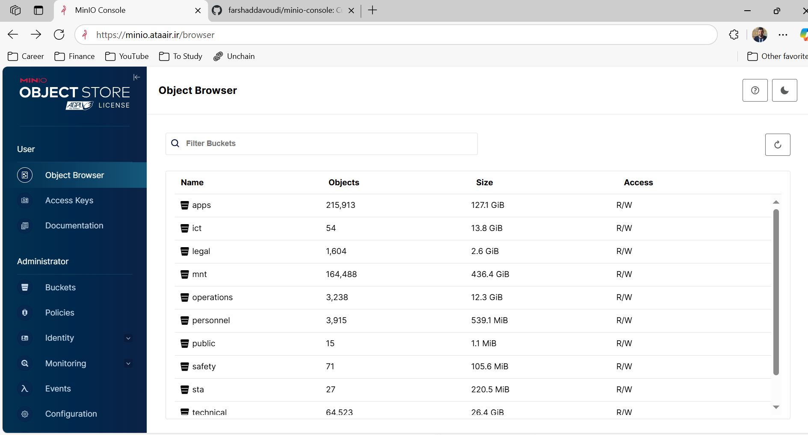
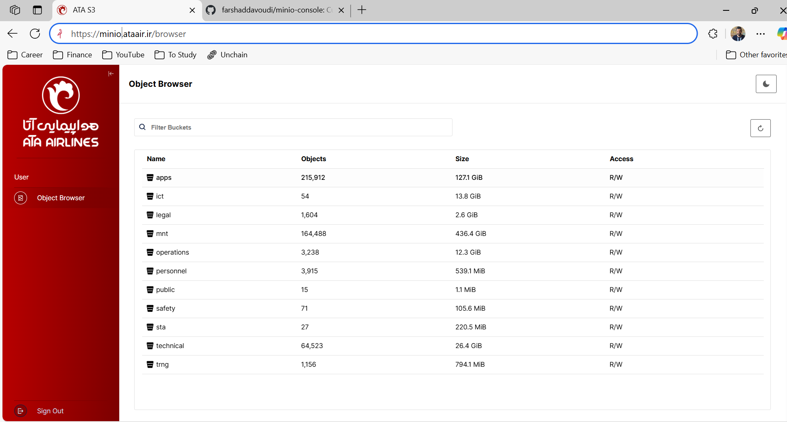

# MinIO Console

 

A graphical user interface for [MinIO](https://github.com/minio/minio)

| Login Page - Old                     | Login Page - New                     | 
|------------------------------------|-------------------------------|
|  |  |

| Object Browser - Old                     | Object Browser - New                     | 
|------------------------------------|-------------------------------|
|  |  |

([Original Readme](https://github.com/minio/console/blob/master/README.md))
